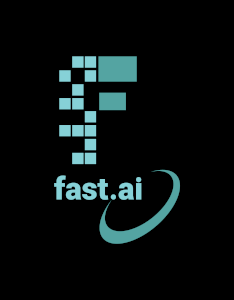

### WHO GAVE  DAN THE POWER TO BLOG???

Hello and welcome to my blog. This was designed as part of a course I am doing at my university. Studying Computer Science and Engineering,  I typically don't have a clue what's going on, but that's the best way to live life. Always new things to learn!

This blog will just be a short collection of some interesting thoughts I've had whilst doing this assignment so please enjoy.

## Quick Bio
Alongside looking at code all night long, I also swim and life save to extreme lengths. Sometimes I travel the world both racing and teaching others in these areas. Yet you will generally still find me on pool deck or the beach with a laptop, headphones max volume, and hands typing furiously away - it is not easy being a student athlete. But the challenge is worthwhile :)
